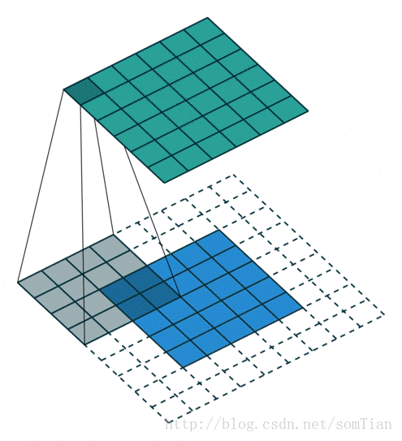
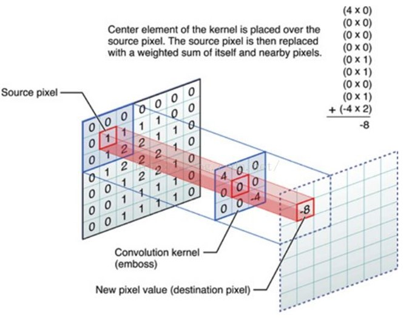
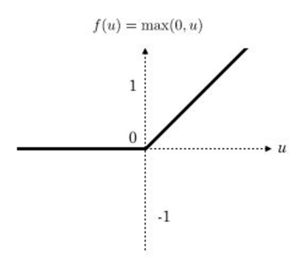
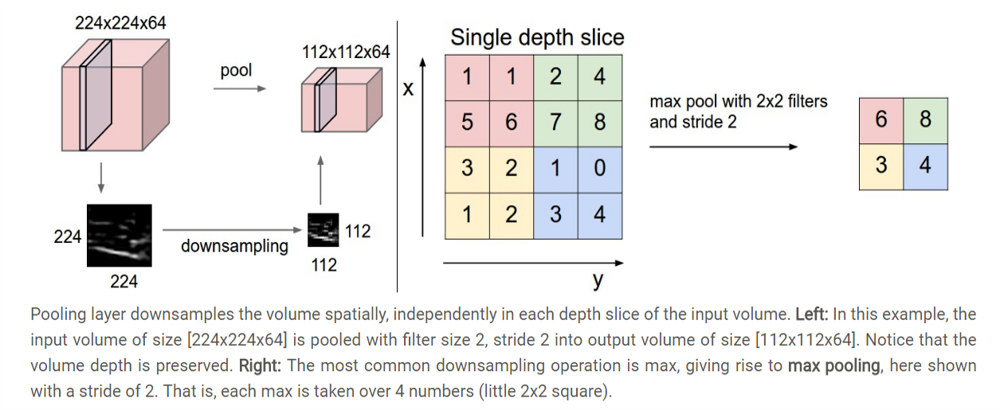
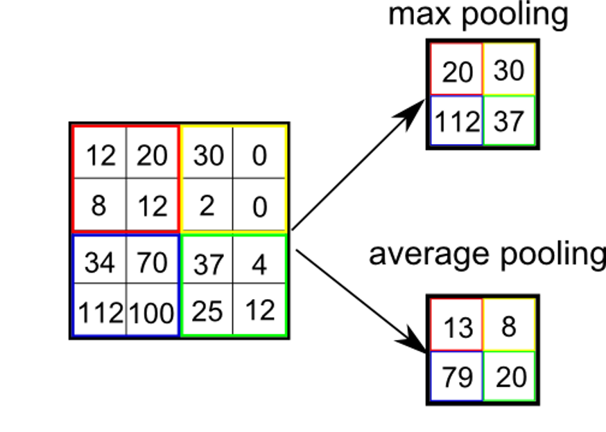
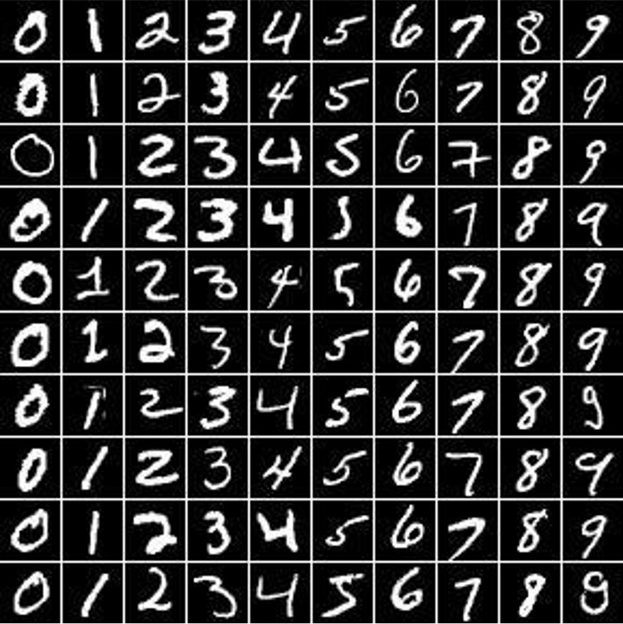
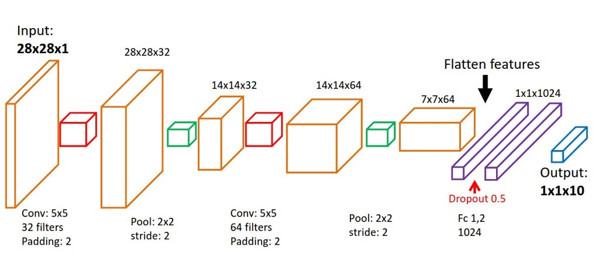

# Image-Classification-using-Conv-Nets
## Dense Neural Net vs Convolutional Neural Net

A Convolutional Neural Network arranges its perceptrons in three dimensions as visualised right side in one of layers. Every layer of a ConvNet transforms the 3D input volume to a 3D output volume of perceptron activations. In the above image, the red input layer holds the image, so its width and height would be the dimension of the image and the depth would be 3(Red, Green, Blue channels) 
### 1. A Simple CNN structure
- CONV : Convolutional Kernel Layer
- RELU : Activation Function
- POOL : Dimension reduction 
- FC : Fully connection layer

### 1.1. Convolutional Kernel

In Convolutional neural network, the kernel is nothing but a filter that is used to extract the features from the images. The kernel is a matrix that moves over the input data, performs the dot product with the sub-region of input data, and gets the output as the matrix of dot products.

### 1.2. Rectified Linear Unit

The rectified linear activation function or ReLU for short is a piecewise linear function that will output the input directly if it is positive, otherwise, it will output zero. It has become the default activation function for many types of neural networks because a model that uses it is easier to train and often achieves better performance.

### 1.3. Pooling

### 1.4. Image Classification
In this project we will perform the image classification by training the ConvNet with MNIST dataset as shown below. This particular dataset has a training set of 60,000 examples and a test set of 10,000 examples. It is a subset of a larger set available from NIST. The digits have been size normalized andd centered in a fixed size image.

### LeNet-5(Largest Convolutional Network) for MNIST

