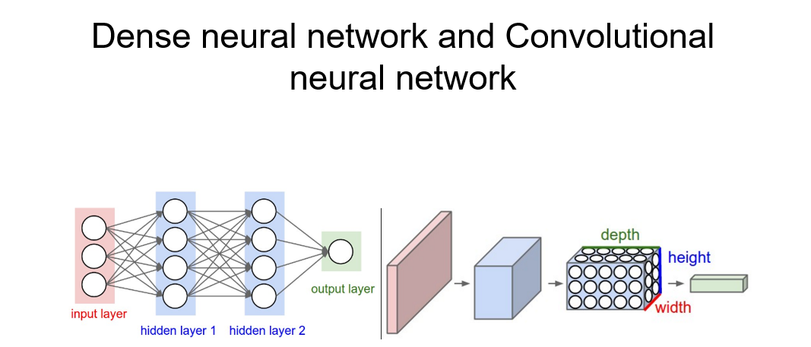
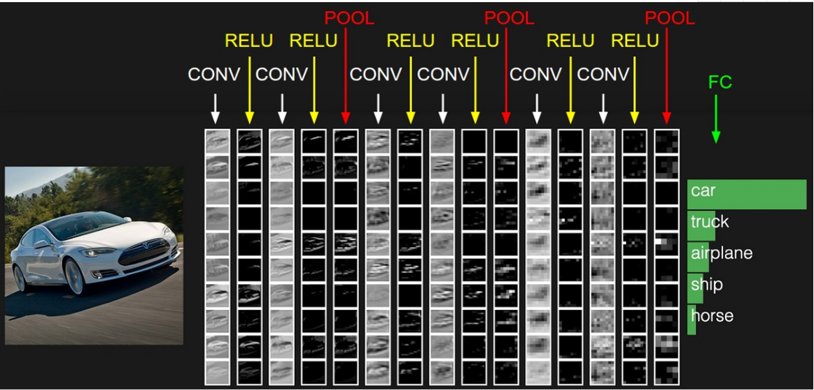

# Image-Classification-using-Conv-Nets
## Dense Neural Net vs Convolutional Neural Net

A Convolutional Neural Network arranges its perceptrons in three dimensions as visualised right side in one of layers. Every layer of a ConvNet transforms the 3D input volume to a 3D output volume of perceptron activations. In the above image, the red input layer holds the image, so its width and height would be the dimension of the image and the depth would be 3(Red, Green, Blue channels) 
### A Simple CNN structure
- CONV : Convolutional Kernel Layer
- RELU : Activation Function
- POOL : Dimension reduction 
- FC : Fully connection layer

### Convolutional Kernel

